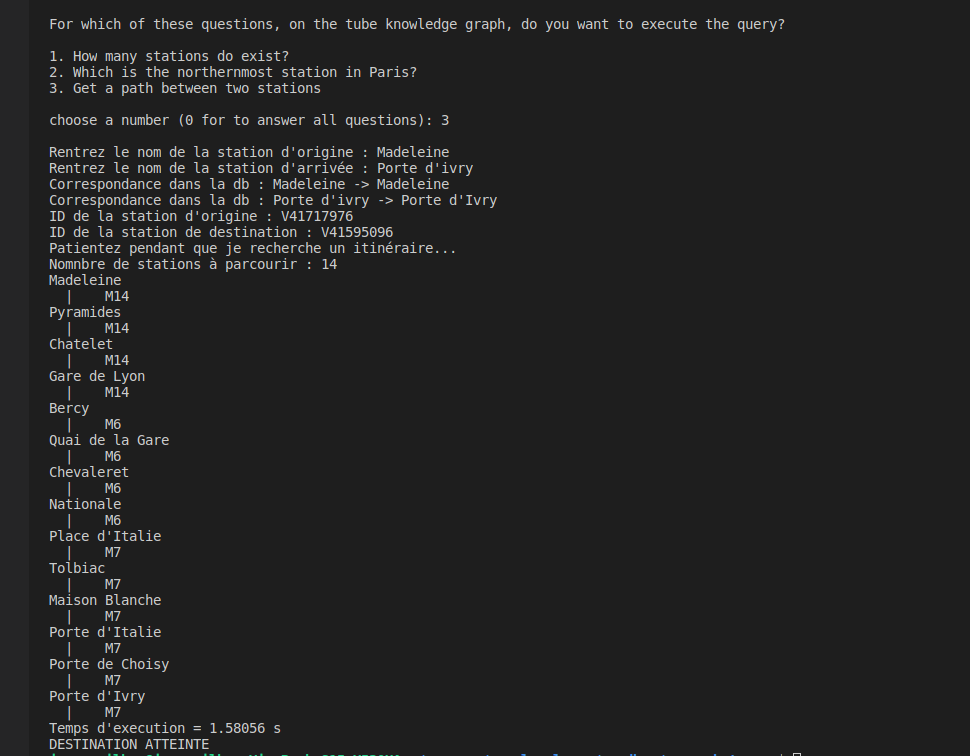
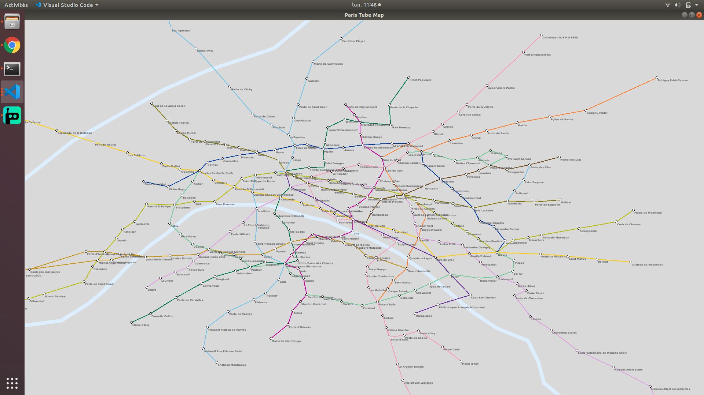
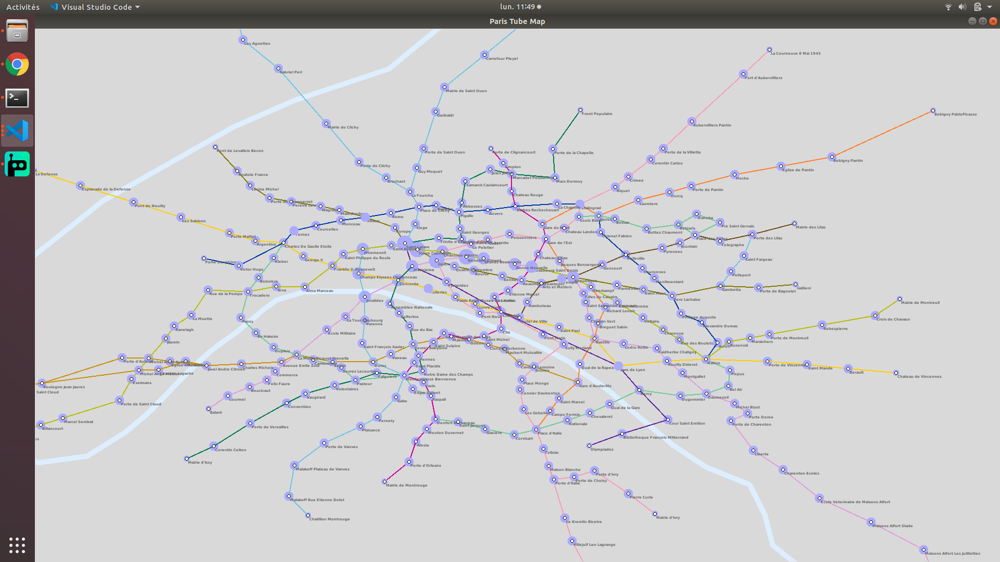
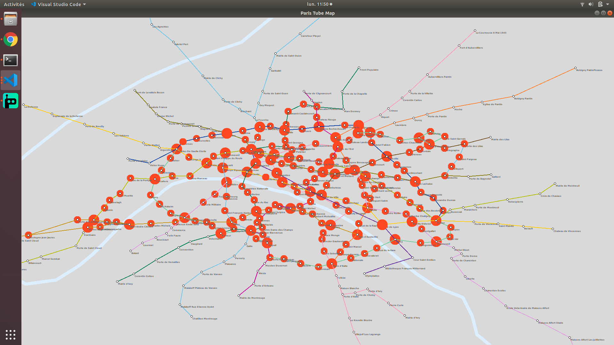

# P.S.P - Paris Subway Project
Paris Subway Project  Drawing a map of the Paris's subway. From line 1 to line 14. All the data has been imported from csv file to a Grakn database and has been requested from it.

It was greatly inspired from the London Underground Network project : https://github.com/graknlabs/examples/tree/3895d8dd5e534b2af04ab448f2392f6eaff9cb59/tube_network

See the Quickstart for how to get going immediately, or read on for more info.

This project was realized as part of my internship at [7LieuesTechnologies](http://www.7lieues.net).

[7LieuesTechnologies](http://www.7lieues.net) aims to support your company, from IT to accounting, by building a virtual assistant which provides multi-technologies and multi-trade help.

## Prerequisites

Python >= 3.6 

six==1.14.0 ( for tkinter ) 

grakn-client==1.7.2

fuzzywuzzy==0.18.0

## Quickstart

- Install Grakn : https://dev.grakn.ai/docs/running-grakn/install-and-run
- Install Grakn Workbase ( not required but usefull and easier to navigate and visualize the data ) : https://grakn.ai/download#workbase
- Launch the Grakn server ( `grakn server start` ) 
- Create the P.S.P Grakn keyspace (via Workspace or console) : `paris_subway`
- Load the schema into the keyspace : `grakn console --keyspace paris_subway  --file schema/schema_subway.gql`
- Load the data into the db by launching the file `migration_subway.py` into `P.S.P/data`
- Launch the file `app.py` in order to get the map
- Launche the file `statistics.py` in order to interact with the data via the console


## Download Data

- I downloaded the stations data from the RATP: https://data.iledefrance-mobilites.fr/explore/dataset/emplacement-des-gares-idf/export/
- I created a csv the data for the lines relation here : https://gist.githubusercontent.com/NaPs/25309/raw/6cbcf7995d49bbf61d2dc7b4bc7dc426bbd3d6d1/paris.gph

You can have access to the code that I used to create all the `data_metro` or `data_metro_MARKII` csv in the file `download_data.py`

But I had to modify a larg ammount of data by hands in order to obtain the perfect data needed. So you will have to do the same if you want to restart all the project from zero. 

Pro tips : just use the final csv files.

## Data

There are two type of csv files : 

- `data_metro_{tube_line_name}.csv` contains all necessary data for a station from the `{tube_line_name}`

station_id [string] : the id of the stations ( not the Grakn id but the id from the RATP ) Ex: "612"

name [string] : the name of the station Ex: "Cambronne"

station_ligne [string] : the name of the line (from 1 to 14 for the Paris subway) Ex: "2"

lat [float] : the latitude gps coordinates for the station Ex: 48.5621

lon [float] : the longitude gps coordinates for the station Ex: 2.2951

- `data_metro_MARKII_{tube_line_name}.csv` contains the relation betweens station from the line `{tube_line_name}`

station_ligne [string] : the line name Ex: "M1"

origin [string] : the name of the origin station Ex: "La Defense"

destination [string] : the name of the destination station Ex: "Esplanade de la Defense"


## Retrieving statistics informations 

You can get statistics informations from the data by launching the file `statistics.py` like : 

- How many stations do exist?
- Which is the northernmost station in Paris?
- Get a path between two stations

In order to improve the project, an interesting question to ask should be "How many stations in a certain line"
You will have to request the db with something such as :

```
match $route (beginning : $station1, end : $station2), has station_ligne "{given_parameter}"; get $station1, $station2;
```

and add a counter for the stations but be careful with duplicated data.

#### Patch between two stations


## The map 



The colors in the map are the real colors given by the RATP.

Normally, you should get the path between two stations by holding shift and clicking on them but it's not working for now (you can still got it via the statistcs information by the way).

From Grakn  : *"The centrality of an instance can be an indicator of its significance. The most interconnected of instances in a Grakn knowledge graph are those that are expected to be the most interesting in their domain. Graql uses two methods for computing centrality - Degree and K-cor"*

You can compute centrality of stations and get a visual information by just pressing `k` ( using k-core )


or by pressing r.


You can clear the map from the previous information by pressing `c`

You can zoom in via `+`/`=`

You can zoom out via `-`
